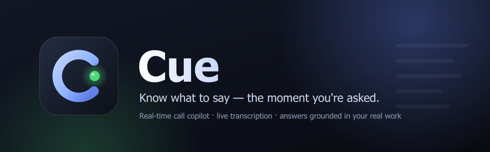
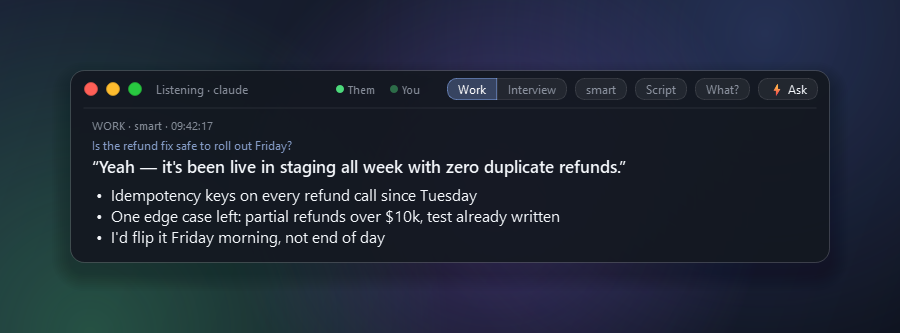
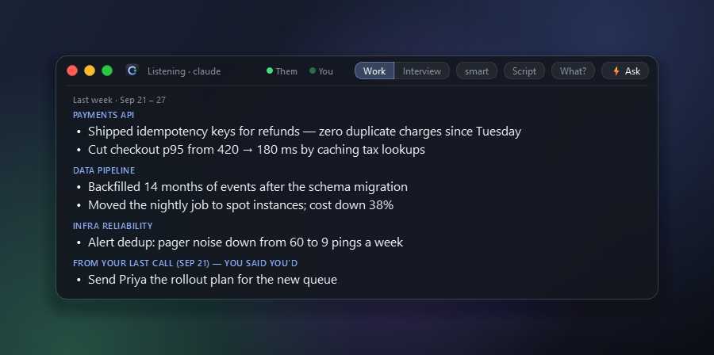
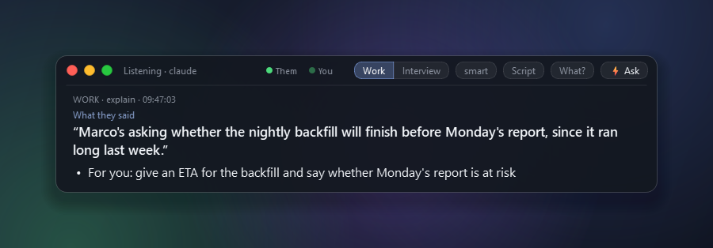
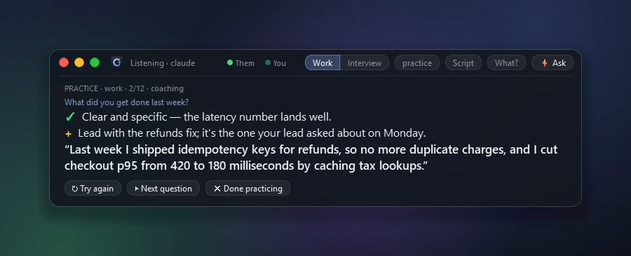
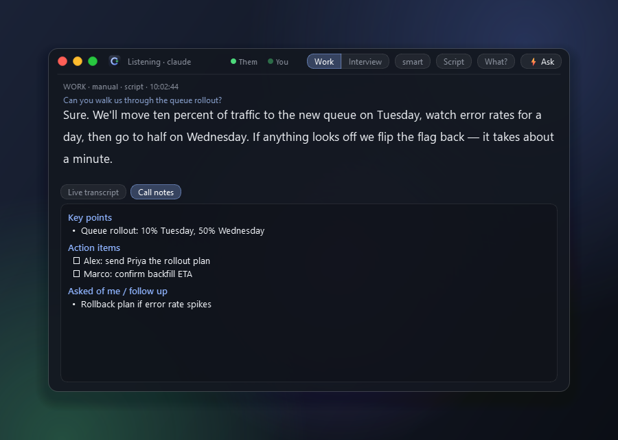
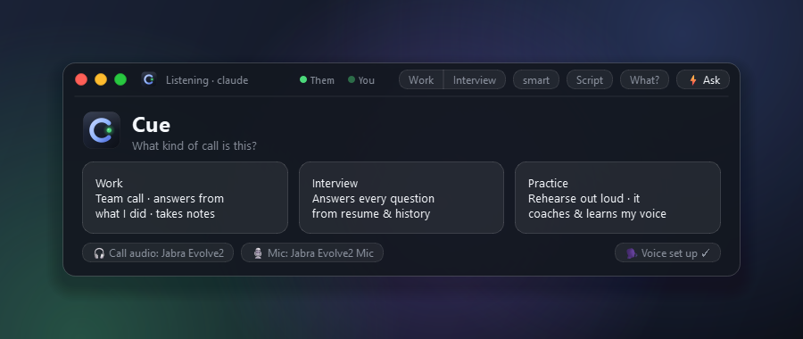

<p align="center">
  
</p>

<p align="center">
  
  
  
  
  <a href="https://github.com/MidActionJax/cue/releases"></a>
</p>

**Cue is a real-time copilot for calls.** It listens to your meeting, transcribes everyone
(heavy accents included), and the moment you're asked something it shows you **what to say**: an
opening line you can say out loud, plus the specifics that make you sound prepared. It knows those
specifics because it reads **what you actually worked on**, rebuilt every morning from your Claude
Code and Claude Cowork history, git commits and past call notes.

It's for anyone who knows their stuff but freezes when it's their turn to talk.

<p align="center">
  
</p>

---

## What it does

|  |  |
|---|---|
| ⚡ **Answers in about a second** | Press `Tab` when you're asked something, or let it pop up when you're named or a question is clearly meant for you. The first words appear in ~0.5 s: an opener you can say as-is, plus 2–3 grounded points. Double-tap `Tab` for a full **script** to read word for word. |
| 🧠 **Knows your actual work** | A daily job reads your Claude Code / Cowork sessions, git history and call notes, and writes a brief: *what you completed last week, grouped by workstream*, status, blockers, and likely questions with answers. A second pass fact-checks every line against your notes. |
| 🗣 **Understands heavy accents** | Whisper `large-v3-turbo` on your GPU, primed with your team's names and jargon, with noise and hallucination filters. Couldn't catch what someone said? **What?** (`Shift+Tab`) turns it into plain English and tells you what they want from you. |
| 📝 **Takes the notes** | Key points, decisions, action items (yours first) and what you were asked, updated live. When the call ends you get polished notes and **a ready-to-send follow-up email**. Next time, your home screen shows what you promised. |
| 👥 **Knows who said what** | Voice fingerprints split the call into speakers. Name someone once and they're recognized on every future call. It also tells your voice apart from other people in the room. |
| 📈 **Learns how you talk** | After each call it compares what it suggested with what you actually said, and learns your phrasing, what you use and skip, and facts you stated. Suggestions sound more like you every week. |
| 🤝 **SBIR mode** | For consulting calls with SBIR program managers and founders: answers from your offer, proof and FAQ, a per-contact prep sheet built from your tracker spreadsheets, and a rules file it never breaks (no invented prices, clients or endorsements). |
| 🎯 **Practice mode** | It asks likely questions out loud, you answer out loud, and it coaches you with what worked, what to add, and a tighter version in your own words. |

<table>
  <tr>
    <td width="50%"><br><sub><b>Work mode home</b>: last week, grouped by workstream, plus what you owe from the last call.</sub></td>
    <td width="50%"><br><sub><b>What?</b>: plain-English version of what was just said, and what they want from you.</sub></td>
  </tr>
  <tr>
    <td width="50%"><br><sub><b>Practice</b>: rehearse out loud, get coached, and train the voice model.</sub></td>
    <td width="50%"><br><sub><b>Live notes</b>: decisions and action items while the call happens.</sub></td>
  </tr>
</table>

The panel is frosted glass, floats above everything, **never takes keyboard focus** (clicking it
won't pull you out of Teams or Zoom), and is **invisible to screen sharing**.

---

## How it works

```mermaid
flowchart LR
    subgraph Live call
      A[Call audio<br/>WASAPI loopback] --> V[VAD + voice<br/>fingerprints]
      M[Your mic] --> V
      V --> W[faster-whisper<br/>on your GPU]
      W --> T[Rolling transcript<br/>who said what]
      T --> Q{Asked something?<br/>name · smart · Tab}
      Q --> L[Claude, streaming<br/>local model fallback]
      L --> P[Glass panel]
      T --> N[Live notes]
    end
    subgraph Every morning
      H[Claude Code + Cowork<br/>sessions, git, call notes] --> D[Daily notes] --> B[Brief: last week<br/>by workstream<br/>+ fact-check]
    end
    B --> L
    N -- after the call --> F[Final notes + follow-up email]
    N -- after the call --> X[Learns how you talk]
    X --> L
```

| Job | Model | Why |
|---|---|---|
| Live answers, scripts, **What?** | Claude Haiku in a persistent session (~0.5 s to first word) | speed and quality |
| …if Claude errors, stalls or hits a usage limit | local `qwen2.5:7b` via Ollama, same context, automatic | never leaves you hanging mid-call |
| "Is that question for me?" | local `qwen2.5:7b` (~0.3 s) | free and instant |
| Final notes, learning, the weekly brief | Claude Sonnet | quality |
| Speech-to-text, voice fingerprints | Whisper `large-v3-turbo`, WeSpeaker ResNet34, all local | fast, private |

Claude runs through the official `claude` CLI on **your own Claude subscription**. No API key is
needed (one is supported if you have it).

---

## Getting started

**You need:** Windows 10/11 · an NVIDIA GPU (built on an RTX 3060, 12 GB) ·
[Claude Code](https://docs.claude.com/en/docs/claude-code) logged in to your Claude account
(`claude auth login`) · [Ollama](https://ollama.com) with `ollama pull qwen2.5:7b` (the local
fallback) · ~6 GB of disk.

### Install (recommended)

1. Download **`Cue-Setup-<version>.exe`** from the [latest release](https://github.com/MidActionJax/cue/releases).
2. Run it. No admin rights needed. It asks two things: where to install the app (~2 GB, mostly
   GPU libraries) and **where to keep your data** (settings, profiles, call notes, and the
   Whisper model, downloaded on first use). Put both on whichever drive has room.
3. Open **Cue** from the Start menu or desktop.

The installer also schedules the daily work-brief refresh (7:30 AM). Uninstalling removes the
app and that task and **leaves your data folder alone**. Upgrading keeps everything.

> **Beta:** the installer isn't code-signed yet, so Windows SmartScreen may warn on first run.
> Choose *More info → Run anyway*.

<details>
<summary><b>Run from source instead</b> (Python 3.11)</summary>

```powershell
git clone https://github.com/MidActionJax/cue.git
cd cue
powershell -ExecutionPolicy Bypass -File setup.ps1   # venv, dependencies, models, daily job, desktop shortcut
```

To build the app and installer yourself: `packaging\build.ps1 -Out D:\CueBuild` (needs
`pip install pyinstaller` and [Inno Setup 6](https://jrsoftware.org/isinfo.php)).

</details>

### Set it up

Fill in the three small files that Cue created from templates in your data folder (all private):

| File | What goes in it |
|---|---|
| `config.yaml` | your name + how transcription mishears it, teammates' names, jargon |
| `profiles/me.md` | your role and how you like to talk |
| `profiles/work/workstreams.md` | the 3–5 things your job breaks into (this drives the "last week" grouping) |

Build your work memory once (after that it updates itself at 7:30 every morning):

```powershell
& "$env:LOCALAPPDATA\Programs\Cue\cue-cli.exe" worklog --backfill   # installed (or wherever you put it)
.\worklog.cmd --backfill                                             # from source
```

`cue-cli.exe` is the command-line side of the app: `worklog`, `note "…"`, `prep`,
`prep-sbir "<name>"`, `sbir-sync`, `accent-test`, `devices`. `Cue.exe --quit` ends a running Cue's call (notes saved) and closes it.

**Before your first call:** open **Cue** from the desktop and pick **Work**. When people talk,
the **Them** light should turn green (click it to pick your call's audio device). Then click
**🗣 Set up my voice** and read for 20 seconds.

---

## Using it



1. Open Cue → **Work**, **Interview**, **SBIR** or **Practice**.
2. Asked something? **`Tab`**.
3. Didn't understand them? **`Shift+Tab`** (What?).
4. Call's over → the **red dot**. Notes save automatically (they save even if the window is just closed).

<br clear="right"/>

| Key / control | |
|---|---|
| `Tab` · ⚡ Ask | What should I say to the question I was just asked? |
| `Tab` `Tab` · **Script** | The same answer as full sentences to read word for word |
| `Shift+Tab` · **What?** | Plain-English version of what was just said, and what they want from you |
| trigger pill | When it answers on its own: `auto` (every question) → `smart` (named, or clearly meant for you) → `name` → `manual` |
| **● Them ● You** | Live audio lights. Click to switch devices. Plugging in a headset mid-call is handled automatically |
| 🔴 🟡 🟢 | End call & save · shrink to a bar · live transcript + notes |
| `Ctrl+Alt+M / T / H / Q` | Switch mode · cycle trigger · hide/re-show · end call |

`Tab` still types a Tab in whatever app you're in; Alt+Tab and Ctrl+Tab don't trigger it.

**Names.** In the transcript pane, click **Speaker 2 ✎** and type who it is. Their voice is saved,
and every future call labels them automatically. For the hardest-to-understand speaker, add their name
to `stt.accurate_speakers` to route only their speech through the slower, more accurate
`large-v3` model.

**Interviews.** Drop your resume and the job description (`job.md`) into `profiles/interview/`
and run `cue-cli prep` (`prep.cmd` from source). You get a 30-second intro, likely questions with talking points in your
voice, STAR stories from your real history, and questions to ask them. Practice mode quizzes you on them.

**SBIR mode.** For consultants on SBIR/STTR calls with referral partners (state programs, SBDCs,
I-Corps hubs, firms) and founders. Fill in `profiles/sbir/` (intro, offer, proof, FAQ, and a
`rules.md` of hard limits, read last so nothing overrides it), point `sbir.tracker_dir` at your
pipeline spreadsheets, and before a call run `cue-cli prep-sbir "Pat Lee"` (or tray → *Prep SBIR
call…*) for a one-page prep on that person. After the call you get a follow-up email in your
style, a line to paste into your tracker, and anything you promised is filed under that contact
for next time.

**Quick notes.** Work that never touched Claude: `cue-cli note "restarted the nightly cron"`, or
tray → *Add a quick note…*. It goes into tomorrow's brief.

**Accents.** To measure the transcriber on a specific person, record a clip where they talk and
compare models side by side: `cue-cli accent-test "meeting.mp4" --start 120 --length 60`.

---

## Your data

- **Stays on your machine**, in the data folder you picked at install (`%USERPROFILE%\Cue` by
  default; the repo folder when running from source): audio (never saved), transcripts, notes,
  voice fingerprints, what Cue learned, and your work brief. To move it, move the folder and edit
  the path in `cue_home.txt` next to `Cue.exe`.
- **Sent to Claude** (through your own account): transcript snippets when you ask for an answer,
  and your summaries/notes when they're generated. Set `llm.backend: ollama` and
  `notes.live_backend: local` to keep live calls fully offline.
- The panel is excluded from screen capture, so people on the call don't see it when you share.
- **Be a good participant.** Check your organization's policies on transcription and AI tools,
  and tell people when a call is being transcribed. Some interviews don't allow assistance at all.

---

## Configuration

Everything lives in `config.yaml`, and every option is commented. The usual knobs:

| Setting | Default | |
|---|---|---|
| `llm.claude_cli_model` | `haiku` | `sonnet` is smarter, ~1 s slower |
| `stt.model` / `stt.accurate_model` | `large-v3-turbo` / `large-v3` | speed vs. accuracy per speaker |
| `stt.voice_match` | `0.6` | raise if two people get merged into one speaker |
| `stt.min_rms` | `0.004` | raise if keyboard or fan noise gets transcribed |
| `overlay.width`, `font_size`, `tint_alpha` | `760`, `16`, `150` | panel look |
| `notes.learn` | `true` | learn your voice from each call |

<details>
<summary><b>Troubleshooting</b></summary>

| Symptom | Fix |
|---|---|
| **Them** light never turns green | click it and pick the device your call audio plays through |
| Title shows `Listening · local` | Claude is unavailable (login or usage limit), so answers come from the local model. Run `claude auth login` |
| Your own speech shows as "In room" | redo **Set up my voice**, or lower `stt.voice_match` |
| Answers feel generic | run `cue-cli worklog`, then fill in `profiles/me.md` and `workstreams.md` |
| Something went wrong on a call | tray → *Open app log* (`data/logs/app-<date>.log` in your data folder) |
| Panel is off-screen | delete `data/ui_state.json` in your data folder |
| Try it without a call | `Cue.exe --demo --mode work` or `--mode sbir` (or `run.cmd --demo …` from source) |

</details>

---

## Roadmap

- [x] **Windows installer**: a compiled app, no Python needed
- [ ] First-run setup inside the app (name, teammates, workstreams) instead of editing files
- [ ] Code-signed builds and auto-update
- [ ] Settings window (devices, names, triggers) instead of editing YAML
- [ ] Calendar awareness: know who's on the call and the agenda before it starts
- [ ] Per-speaker transcription tuning that adapts to each accent over time
- [ ] Send the follow-up email straight from the notes
- [ ] macOS support

---

## Project layout

```
cue/          the app: audio, speech-to-text, speakers, triggers, LLM backends, panel, notes, practice
worklog/      the daily job: chat history + git + notes → daily notes → weekly → brief (+ fact-check) → history
profiles/     your context (templates ship as *.example.md; your copies stay private)
assets/       logo, icon, splash, installer art, screenshots (tools/ regenerates them)
packaging/    PyInstaller spec + Inno Setup installer (build.ps1 builds both)
```

Built on [faster-whisper](https://github.com/SYSTRAN/faster-whisper),
[sherpa-onnx](https://github.com/k2-fsa/sherpa-onnx) + WeSpeaker, [Ollama](https://ollama.com),
PyQt6, and [Claude](https://claude.com).

## License

[MIT](LICENSE) © Jaxon Doolittle
